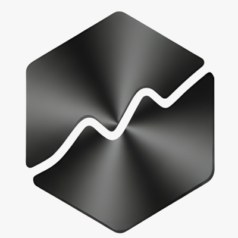

<div align="center">



# TraderSpy MCP

**Crypto smart money & AI signals, wired straight into your AI assistant.**

[](https://glama.ai/mcp/connectors/app.traderspy/traderspy)
[](https://mcpi.app/servers/traderspy)
[](https://github.com/target1m/traderspy-mcp/blob/master/LICENSE)
[](#tool-catalogue)
[](#quick-start)

**17 read-only tools · 4 exchanges · 19 technical indicators · 3 interactive views**
One URL. No install, no daemon, no broker, no API keys of your own.

</div>

---

Connect Claude, Claude Code, ChatGPT, Grok, Cursor, Cline or any MCP client to TraderSpy's live
crypto futures data: AI-generated signals with real targets, whale positioning across four
exchanges, prices, candles, indicators, derivatives, a condition screener and an event-study
backtester.

```
You ask:                             It calls:                     It reads:

"Which coins are oversold?"      →  screen_symbols()           →  top 100 by 24h volume, one pass
"Is BTC still trending?"         →  get_technical_indicators() →  1h + 4h + 1d in a single call
"What are the whales doing?"     →  get_positions()            →  Binance · Hyperliquid · Bybit · OKX
"Is this signal still valid?"    →  get_signal_details()       →  live price against entry / TP / SL
"What happens after this setup?" →  backtest_condition()       →  up to 1000 stored candles
```

> **Every tool is read-only.** This connector cannot place, close or modify an order, it has no
> withdrawal or transfer tool, and it cannot see anyone's account. It answers questions with public
> market data. See [Security](#security).

---

## Contents

[Quick start](#quick-start) · [What it answers](#what-it-answers) · [Tool catalogue](#tool-catalogue) ·
[Interactive views](#interactive-views) · [Skills](#skills) · [Authentication](#authentication-and-limits) ·
[Security](#security) · [Data sources](#data-sources) · [Architecture](#architecture) ·
[Prompts to try](#prompts-to-try) · [Changelog](#changelog)

---

## Quick start

Everything below points at the same endpoint: `https://mcp.traderspy.app/mcp`.

**Claude, Claude Code, ChatGPT, Grok and Gemini sign in with your TraderSpy account** (OAuth), so
there is no key to copy. A free account is enough. Clients that cannot open a sign-in window
(Cursor, Cline, Windsurf, Grok Build, n8n, scripts) use a personal key instead: get it from the
**Other clients** tab at **[traderspy.app/mcp](https://traderspy.app/mcp)**. It starts with `mcp_`,
the page can show it again, and it is revocable at any time.

### Claude (web, desktop and mobile)

**Settings → Connectors → Add custom connector**, paste `https://mcp.traderspy.app/mcp`, then click
**Connect** and sign in with your TraderSpy account. No key to paste.

### Claude Code

**As a plugin** — also installs the six [skills](#skills):

```
/plugin marketplace add target1m/traderspy-mcp
/plugin install traderspy@traderspy-mcp
```

Then type `/mcp`, pick **traderspy** and choose **Authenticate**. Your browser opens the TraderSpy
sign-in once; click **Allow access** and Claude Code keeps the token. Coming from 1.7.0 or earlier,
which asked for a key at install? That key is no longer used: authenticate once the same way.

No browser on that machine (a server, CI)? Export your personal URL before starting Claude Code and
the plugin connects with it instead:

```bash
export TRADERSPY_MCP_URL="https://mcp.traderspy.app/mcp?token=mcp_YOUR_KEY"
```

**Or as a plain MCP server**, then authenticate the same way from `/mcp`:

```bash
claude mcp add --transport http traderspy https://mcp.traderspy.app/mcp
```

### ChatGPT

TraderSpy is in the ChatGPT plugin directory:

1. Open [chatgpt.com/plugins](https://chatgpt.com/plugins) (or **Settings → Plugins**), search for
   **TraderSpy** and click **Connect**
2. Sign in with your TraderSpy account and click **Allow access**
3. Pick TraderSpy in a chat with **@** or from the **+** menu

Prefer your own connector? Turn on **Developer mode** in **Settings → Security and login**, then
click **+** on the Plugins page, paste `https://mcp.traderspy.app/mcp` and choose **OAuth**.

### Grok (xAI)

[grok.com/connectors](https://grok.com/connectors) → **New Connector → Custom**, then paste
`https://mcp.traderspy.app/mcp`. Grok opens the TraderSpy sign-in: sign in and click
**Allow access**, and leave any client ID and secret fields empty.

No sign-in appeared, or the tools don't answer? Paste your personal URL instead. The key is embedded,
so the host's authentication can stay on "None":

```
https://mcp.traderspy.app/mcp?token=mcp_YOUR_KEY
```

Grok Build cannot open a sign-in window, so from the terminal it always takes the personal URL:

```bash
grok mcp add --transport http traderspy "https://mcp.traderspy.app/mcp?token=mcp_YOUR_KEY"
```

As a Grok Build **plugin** (the server plus the six skills), the repo carries `.grok-plugin/plugin.json`
and `.grok-plugin/mcp.json`; the xAI plugin marketplace listing is in review. Grok Build has no
install-time prompt for secrets, so the plugin reads your key from `TRADERSPY_API_KEY` in the
environment that launches `grok`.

The personal URL also works as a remote MCP tool in the xAI API. Grok speaks Streamable HTTP and
SSE — so does this server.

### Cursor

**As a plugin** — also installs the six [skills](#skills). This repo is a Cursor plugin
(`.cursor-plugin/plugin.json` + `mcp.json`): install **TraderSpy** from the Cursor Marketplace
(listing in review), or clone the repo into `~/.cursor/plugins/local/traderspy` and run
**Developer: Reload Window**. Cursor asks for your key as `TRADERSPY_API_KEY` at install (change it
later under **Plugins → Configure**) and sends it as a bearer token; it never lands in your repo.

**Or as a plain MCP server** — `.cursor/mcp.json`:

```json
{
  "mcpServers": {
    "traderspy": {
      "url": "https://mcp.traderspy.app/mcp",
      "headers": {
        "Authorization": "Bearer mcp_YOUR_KEY"
      }
    }
  }
}
```

### Cline

`cline_mcp_settings.json`:

```json
{
  "mcpServers": {
    "traderspy": {
      "type": "streamableHttp",
      "url": "https://mcp.traderspy.app/mcp",
      "headers": {
        "Authorization": "Bearer mcp_YOUR_KEY"
      },
      "disabled": false,
      "autoApprove": []
    }
  }
}
```

`type` must be exactly `streamableHttp`. `streamable-http`, or leaving `type` out, falls back to SSE
and the server answers 405. Full walkthrough: **[llms-install.md](llms-install.md)**.

### Gemini CLI

```bash
gemini extensions install https://github.com/target1m/traderspy-mcp
```

The extension (`gemini-extension.json`) adds the server and the six skills. It signs in with
OAuth rather than a key: run `/mcp auth traderspy` once inside Gemini CLI.

In the **Gemini app** (gemini.google.com or mobile): **Settings → Connected apps**, add a custom app,
paste `https://mcp.traderspy.app/mcp` and sign in. Google offers custom apps only in the US, in
English, on a personal Google account with Keep Activity on.

### Windsurf and other MCP clients

The personal URL works in any client that takes an MCP server URL:

```json
{
  "traderspy": {
    "type": "http",
    "url": "https://mcp.traderspy.app/mcp?token=mcp_YOUR_KEY"
  }
}
```

A client that implements MCP authorization can take the bare URL instead: the server answers an
unauthenticated tool call with `401` and a `WWW-Authenticate` header, which starts its sign-in. That
works when the client's OAuth callback is a loopback address (`http://localhost:<port>`,
`http://127.0.0.1:<port>`) or one of the hosts above. Custom-scheme callbacks (`cursor://`,
`vscode://`) and other web callbacks are refused at registration, so those clients use the personal
URL.

---

## What it answers

The server publishes this routing to the model itself, so you rarely have to name a tool:

| You ask about | It calls |
| --- | --- |
| Price, 24h change, volume | `get_price` — several symbols in one call |
| OHLCV for charting | `get_candles` |
| "Analyse X", oversold, trend, support/resistance | `get_technical_indicators` — up to 3 timeframes and 3 coins per call |
| Funding, open interest, long/short, taker flow | `get_derivatives` |
| "Which coins are…", "find setups", "compare A B C" | `screen_symbols` |
| "What usually happens after…" | `backtest_condition` |
| AI signals, their detail, their track record | `get_signals` · `get_signal_details` · `get_signal_stats` |
| Whales, best traders, who is long X | `get_top_traders` · `get_elite_leaderboard` · `get_trader_profile` · `get_trader_position_history` · `get_positions` |
| Coverage and venue context | `get_tracked_symbols` · `get_exchanges` · `get_market_stats` |

**Batch, don't loop.** Calls are metered per day, and the tools are built so one call replaces many:
several symbols in a single `get_price`, three timeframes and three coins in a single
`get_technical_indicators` (one quota unit, and you get the confluence across the timeframes), and
`screen_symbols` instead of running indicators symbol by symbol.

---

## Tool catalogue

**17 tools, every one read-only, every one annotated `readOnlyHint: true`.**

### Signals — 3 tools

| Tool | What it returns |
| --- | --- |
| `get_signals` | Recent AI signals with filtering — symbol, side, entry, TP1–TP3, stop, strength, validation score |
| `get_signal_details` | One signal in full: AI review, trigger conditions, every level as an absolute price, realised outcome, and the live price to judge whether it still applies |
| `get_signal_stats` | Track record over a period — win rate, profit factor, resolution breakdown |

### Smart money — 7 tools

| Tool | What it returns |
| --- | --- |
| `get_top_traders` | Ranked traders per exchange, by the metric you choose |
| `get_elite_leaderboard` | Top 10 by SmartScore (weighted PnL, win rate, ROI, consistency, longevity, depth, recency) |
| `get_trader_profile` | One trader: metrics plus their open positions |
| `get_trader_position_history` | That trader's closed trades |
| `get_positions` | Live and historical smart-money positions, filterable by symbol and exchange |
| `get_market_stats` | Aggregate long/short and notional across tracked traders |
| `get_exchanges` | Which venues are tracked and enabled |

### Market data & research — 7 tools

| Tool | What it returns |
| --- | --- |
| `get_price` | Real-time price, 24h high/low, volume and change% — one or many symbols |
| `get_candles` | OHLCV for `1m`, `5m`, `15m`, `1h`, `4h`, `1d` |
| `get_technical_indicators` | 19 indicators — RSI, MACD, EMA, SMA, Bollinger, ATR, ADX, Stochastic, OBV, VWAP, CCI, MFI, Williams %R, ROC, SuperTrend, Ichimoku, Keltner, pivots, swing S/R. Each carries value + previous bar + direction + a history series. Multi-timeframe (`intervals`, ≤ 3) with a per-timeframe `summary` and a cross-timeframe `confluence`; several coins in one call (`symbols`, ≤ 3, one entry per coin); custom `periods`; RSI/MACD divergence, Fibonacci retracement, volume profile, ATR percentile, TTM squeeze and candlestick patterns |
| `get_derivatives` | Funding (current, 24h/3d average, annualised), open interest (24h/4h change, OI×price regime), top-trader and all-account long/short ratios, taker flow — up to 5 Binance perpetuals, with the interpretation traders actually quote |
| `screen_symbols` | Scan the most-traded pairs (≤ 100, ranked by 24h volume) or an explicit list, for up to 3 AND-ed conditions over 17 metrics — `rsi`, `stochastic`, `cci`, `mfi`, `williamsR`, `adx`, `roc`, `macdHistogram`, `atrPct`, `volumeRatio`, `bbPercentB`, `bbWidthPct`, `priceVsEma`, `emaSpread`, `supertrend`, `changePct`, `price` — with `lt` / `gt` / `crossAbove` / `crossBelow`. One quota unit. Drop the conditions and pass `symbols` to get a comparison table instead |
| `backtest_condition` | Event study on one symbol and timeframe: every occurrence over the stored tape (≤ 1000 candles), forward return / win rate / best and worst excursion per horizon, the unconditional baseline and the **edge over it**, the last five episodes, and whether the condition is live right now |
| `get_tracked_symbols` | Every symbol with real-time data available |

---

## Interactive views

In hosts that support **MCP Apps**, three tools render a real interface instead of a wall of text.
Every view is a single self-contained HTML bundle with a deny-all CSP — it makes no network call of
its own, because the data arrives inside the tool result.

| Tool | View |
| --- | --- |
| `get_signals` | A card carousel — each card charts 24h of price with the entry, the next unreached take-profit and the stop drawn across it. Pages through the full result set, it never shows a silent slice |
| `get_signal_details` | One signal: chart with a price scale, the live price, entry / exit / level-hit markers judged on wicks, every level as an absolute price, the realised outcome and the validation meters |
| `get_technical_indicators` | Per timeframe a 96-bar chart with EMA lines, the SuperTrend band and swing / pivot support-resistance drawn across it, the summary's notes, one chip per indicator and a levels table. Several timeframes become tabs, and so do several coins; footer buttons re-run the tool for 1h / 4h / 1d |

Verified on claude.ai web with the deployed connector. Hosts without MCP Apps get the same data as text and structured
content — nothing degrades.

---

## Skills

The plugin ships six skills: playbooks that tell the assistant which tools answer which question,
how to read the fields, and how to present the result without turning market data into advice. They
live in `skills/<name>/SKILL.md` (Agent Skills format) and load automatically in Claude Code,
Cursor, Grok Build and Gemini CLI. For the ChatGPT plugin portal, run `scripts/package-skills.sh`
and upload the ZIPs from `dist/skills/`.

Any other Agent Skills client can install them with the [skills](https://skills.sh) CLI. The
skills need the MCP server connected, as shown in [Quick start](#quick-start):

```bash
npx skills add target1m/traderspy-mcp                          # all six
npx skills add target1m/traderspy-mcp --skill market-briefing  # just one
```

| Skill | Triggers on | Tools it drives |
| --- | --- | --- |
| `market-briefing` | "what's happening in crypto", "morning brief", "market update" | price, derivatives, screener, signal stats, signals |
| `technical-analysis` | "analyse BTC", "is SOL oversold", support/resistance, funding, open interest | technical indicators (multi-timeframe), derivatives, price, candles |
| `market-screener` | "which coins are oversold", "find setups", "compare BTC ETH SOL", "what happened after…" | screener, backtest |
| `trading-signals` | "latest AI signals", "is this signal still valid", "how are the signals doing" | signals, signal details, signal stats |
| `smart-money` | "what are whales doing", "best traders on Hyperliquid", "research this trader" | leaderboard, top traders, positions, profile, history, market stats |
| `position-check` | "how far am I from liquidation", "what do you think of my long", a pasted position | technicals, derivatives, positions |

Every skill carries the same conduct rules: report what the data shows and leave the decision to the
user, never present a hit rate or a backtest as a forecast, and say plainly that the connector cannot
place, close or move anything.

---

## Authentication and limits

Two ways to connect, both tied to your TraderSpy account:

- **Sign in (OAuth 2.1, recommended)** — Claude, Claude Code, ChatGPT, Grok and Gemini take the bare
  URL and open the TraderSpy sign-in (dynamic client registration, PKCE, scope `mcp.read`). There is
  nothing to copy, and the host renews its own token.
- **Personal key** — for clients that cannot open a sign-in window. Get it from the **Other clients**
  tab at [traderspy.app/mcp](https://traderspy.app/mcp) and send it as `Authorization: Bearer mcp_…`,
  or embed it in the URL (`https://mcp.traderspy.app/mcp?token=mcp_...`) for hosts whose
  authentication can only be "None".

Treat a personal URL like a password: anyone holding it can spend your daily quota. If it leaks,
regenerate it on the same page and the old URL stops working at once. **Disconnect all apps** on the
same page signs every connected assistant out, sign-ins and the personal key alike. Both take effect
on the very next call.

| Plan | Daily calls | Data |
| --- | --- | --- |
| Free | 300 | Real-time, except top-trader position rows (15-minute delay) |
| Premium | 5,000 | Real-time |

A three-coin, three-timeframe `get_technical_indicators` and a 100-symbol `screen_symbols` each cost **one** call,
deliberately — the cheap way to use the connector is also the fast one.

Don't have an account? **[Sign up free](https://traderspy.app)**.

---

## Security

This connector's security model is mostly a list of things that do not exist.

| Scope | How you authenticate | What it can reach |
| --- | --- | --- |
| Anonymous | nothing | the tool catalogue only — `tools/list`, so directories can index it. Every actual call is refused. Claude, Claude Code and Grok get a `401` on their first request instead, which is what opens their sign-in |
| OAuth | sign in from the host | all public market data |
| Personal key | `mcp_…` as a bearer token or `?token=` | the same |

**What no credential can do here:**

- **No order tool.** Placing, closing or modifying an order does not exist. The order tools were not
  hidden or feature-flagged; they were deleted.
- **No withdrawal, transfer or deposit tool.**
- **No account tool.** Nothing reads a balance or a position, and the connector has no client
  toward the trading service at all, so no code path can reach an account even by mistake.
- **No standing rules.** It cannot create alerts, subscriptions or automations on your account.

Two reasons, and the second is the load-bearing one. First, the Anthropic Software Directory Policy
excludes software that executes financial transactions on a user's behalf — and hiding such tools at
call time is not enough, they must not appear in `tools/list`. Second, an MCP credential is a
long-lived bearer token handed to a third-party host: everything it can reach is reachable by whoever
holds it. So it reaches reads only.

Trading belongs in the TraderSpy web app or mobile app, where you are present for it.

---

## Data sources

| Source | What comes from it | Freshness |
| --- | --- | --- |
| TraderSpy AI signal engine | Signals, targets, stops, validation scores, realised outcomes | Evaluated on cron; published only after validation |
| Smart-money trackers | Whale positions, leaderboards, trade history | 5–60 min per exchange |
| Candle store | Prices, OHLCV, every indicator, the screener and the backtester | Live candle plus the last 1000 closed |
| Binance Futures public API | Funding, open interest, long/short ratios, taker flow | 60s cache |

Coverage is the Binance USDⓈ-M perpetual universe, plus perpetuals that trade on Hyperliquid but not
on Binance. `get_tracked_symbols` is the authoritative list.

---

## Architecture

```
Your AI client   Claude · Claude Code · ChatGPT · Grok · Cursor · Cline · Windsurf
       │
       │  MCP over Streamable HTTP (+ SSE)
       ▼
mcp.traderspy.app/mcp
       ├── 17 read-only tools       no order · no withdrawal · no account
       ├── 3 MCP Apps views         cards and charts where the host supports them
       ├── per-user daily quota     300 free · 5,000 premium
       └── OAuth sign-in · personal key (header or URL)
       │
       ▼
TraderSpy platform
       ├── AI signal engine         entry · TP1–TP3 · stop · validation · outcome
       ├── Smart-money trackers     Binance · Hyperliquid · Bybit · OKX
       ├── Candle store             Binance USDⓈ-M + Hyperliquid-only perpetuals
       └── Binance Futures API      funding · open interest · long/short · taker flow
```

---

## Prompts to try

**Morning brief**

> "Give me a crypto morning brief: what moved, where funding is stretched, and what the AI signals
> fired overnight."

**Find a setup**

> "Run the screener: RSI under 30 and ADX above 25 on the 4h, top 100 by volume. For anything it
> finds, show me the multi-timeframe read."

**Check a thesis before acting**

> "Historically, what happened on SOLUSDT 4h after RSI crossed above 30? Compare it against the
> baseline over the same tape."

**Follow the whales**

> "Who are the most profitable traders on Hyperliquid right now, and what are they positioned in?
> Then show me the position history of the top one."

**Judge a signal**

> "Is the latest BTC signal still valid? Show me where price is against its entry, targets and stop."

**Check a position you hold elsewhere**

> "I'm long ETH from 2,400 at 10x. How far is liquidation, and what do the 1h/4h/1d indicators say
> about it?"

**Compare coins**

> "Compare BTC, ETH and SOL on the 4h: trend, momentum, funding and open interest."

---

## Changelog

| Date | Change |
| --- | --- |
| 2026-10-03 | `get_technical_indicators` takes `symbols` — up to three coins in one call, one quota unit, one entry per coin. `technical-analysis`, `market-screener` and `position-check` read several coins with it instead of one call per coin; registry entry 3.0.2 (v1.9.0) |
| 2026-10-01 | Registry entry `app.traderspy/traderspy` 3.0.1 published without the key header (3.0.0 keeps it: registry versions are immutable); `server.json` here follows |
| 2026-10-01 | README: Claude (web, desktop and mobile) setup, ChatGPT's Developer mode lives in **Settings → Security and login**, and which OAuth callbacks the server accepts (loopback or the listed hosts; custom schemes use the personal URL) |
| 2026-09-30 | The Claude Code plugin signs in with OAuth instead of asking for a key at install: `/mcp` → Authenticate once, and `TRADERSPY_MCP_URL` takes a personal URL for machines without a browser. Claude, ChatGPT, Grok and Gemini connect by signing in, and the personal key stays for Cursor, Cline, Grok Build and scripts. `server.json` no longer declares a required key header (v1.8.0) |
| 2026-09-25 | `get_my_account` and its account view removed — TraderSpy offers no trading or balances, so the connector reads public market data only (17 tools). `position-check` works on positions the user describes (v1.7.0) |
| 2026-09-25 | No skill sends the user to traderspy.app to execute: the decision and the trade stay with them (v1.6.3) |
| 2026-09-25 | Skill copy matches the product as it is now: no copy-trading pointer in `smart-money`, no edge claim in `trading-signals` (v1.6.2) |
| 2026-09-25 | `trading-signals` points at the signals feed; the /performance page it linked was retired (v1.6.1) |
| 2026-09-25 | Gemini CLI extension (`gemini-extension.json`), `server.json` for registries that read the repo, limits quoted as 300/5,000 a day (v1.6.0) |
| 2026-09-25 | Grok Build plugin: `.grok-plugin/plugin.json` + `mcp.json`, key from `TRADERSPY_API_KEY` (v1.5.0) |
| 2026-09-22 | Cursor plugin: `.cursor-plugin/plugin.json` + `mcp.json`, key as `TRADERSPY_API_KEY` |
| 2026-09-15 | Plugin asks for the API key at install instead of connecting keyless (v1.4.0) |
| 2026-09-12 | Six playbook skills, packaged per skill for the ChatGPT plugin portal |
| 2026-09-09 | `screen_symbols` and `backtest_condition` — the condition language; 18 tools |
| 2026-09-09 | `get_derivatives` — funding, open interest and positioning |
| 2026-09-09 | `get_technical_indicators` rebuilt: 19 indicators, multi-timeframe, custom periods, series-aware |
| 2026-08-26 | Interactive MCP Apps views |
| 2026-08-15 | Read-only by construction — every order tool removed, not disabled |

---

## Links

- **[TraderSpy](https://traderspy.app)** — the platform
- **[traderspy.app/mcp](https://traderspy.app/mcp)** — connect your assistant, get a personal key for other clients, read the tutorial
- **[Glama listing](https://glama.ai/mcp/connectors/app.traderspy/traderspy)** — independent inspection and tool grading
- **[mcpi listing](https://mcpi.app/servers/traderspy)** — uptime, auth matrix and a classified contract changelog, probed every six hours
- **[llms-install.md](llms-install.md)** — install walkthrough for AI agents
- **[Smithery](https://smithery.ai/servers/traderspy/traderspy)** — alternative install path
- **[Privacy policy](https://traderspy.app/privacy-policy)** · **[Support](mailto:support@traderspy.app)**

## Disclaimer

TraderSpy provides market data and analysis, not financial advice. Signal statistics and backtests
describe what already happened; they are not a forecast and not a guarantee. Trading crypto futures
carries substantial risk. You are responsible for your own decisions.

## License

[MIT](LICENSE) © TraderSpy
